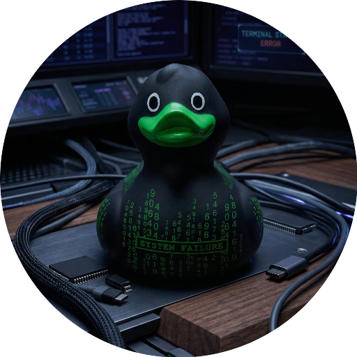

<div align="center">
  

  <h1>Hey, I'm Sebas 👋</h1>

  <p>
    Developer from the Netherlands who loves building beautiful, smart, and useful things.
    From tiny experiments to complete projects: I like code with character.
  </p>

  <p>
    
    
    
  </p>
</div>

---

## 🚀 What I Do

I build digital solutions with an eye for detail, speed, and usability.
My favorite kind of project is the kind where an idea turns into something that truly works.

```txt
💡 Idea        -> clear plan
🧩 Complexity  -> clean structure
⚡ Prototype   -> working product
🎯 Product     -> ready to use
```

## ✨ By The Numbers

| 🌍 Country | 🧑‍💻 Developer since | 🏆 Projects completed |
|---|---:|---:|
| Netherlands | 2013 | 130+ |

## 🛠️ My Vibe

- 🧠 Curious about how things work
- 🎨 Fan of playful details and clean interfaces
- 🔧 Into building, improving, and automating
- 🚀 Always up for a good idea that can be made a little smarter

## 🎮 Side quest

If something can be more boring, it can usually be more fun too.
That's why I try to give even practical projects a bit of personality.

<div align="center">
  
</div>
