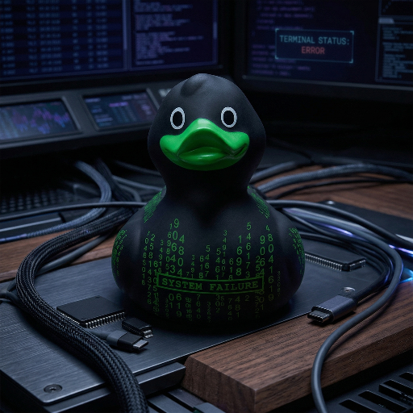

<div align="center">
  

  <h1>Hey, ik ben Sebas 👋</h1>

  <p>
    Developer uit Nederland die graag mooie, slimme en bruikbare dingen bouwt.
    Van kleine experimenten tot complete projecten: ik hou van code met karakter.
  </p>

  <p>
    
    
    
  </p>
</div>

---

## 🚀 Wat ik doe

Ik bouw digitale oplossingen met oog voor detail, snelheid en gebruiksgemak.
Mijn favoriete soort project is het soort waarbij een idee verandert in iets dat echt werkt.

```txt
💡 Idee         -> helder plan
🧩 Complexiteit -> nette structuur
⚡ Prototype    -> werkend product
🎯 Product      -> klaar voor gebruik
```

## ✨ In cijfers

| 🌍 Country | 🧑‍💻 Developer since | 🏆 Projects completed |
|---|---:|---:|
| Netherlands | 2013 | 130+ |

## 🛠️ Mijn vibe

- 🧠 Nieuwsgierig naar hoe dingen werken
- 🎨 Fan van speelse details en nette interfaces
- 🔧 Graag bezig met bouwen, verbeteren en automatiseren
- 🚀 Altijd in voor een goed idee dat net iets slimmer kan

## 🎮 Side quest

Als iets saaier kan, kan het meestal ook leuker.
Daarom probeer ik zelfs praktische projecten een beetje persoonlijkheid mee te geven.

<div align="center">
  
</div>
